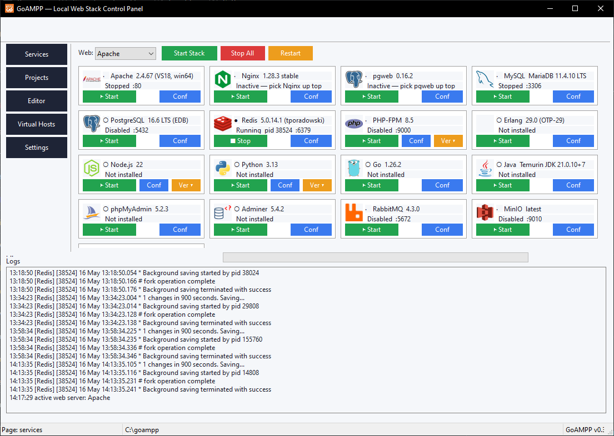
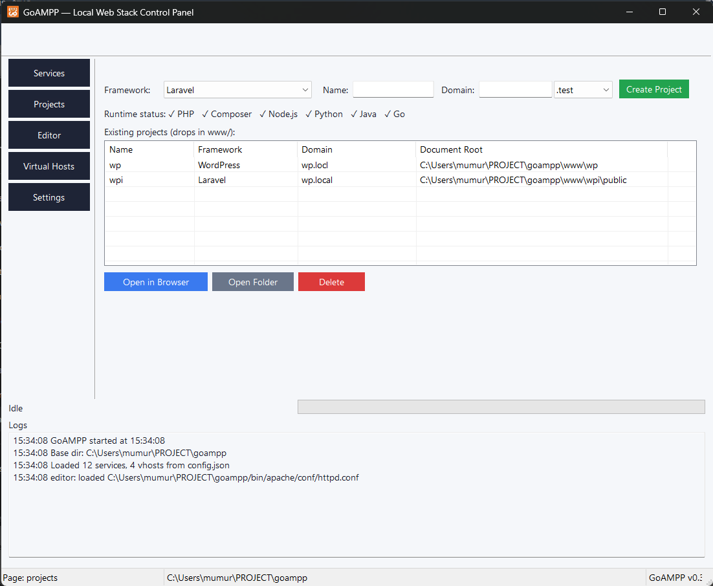
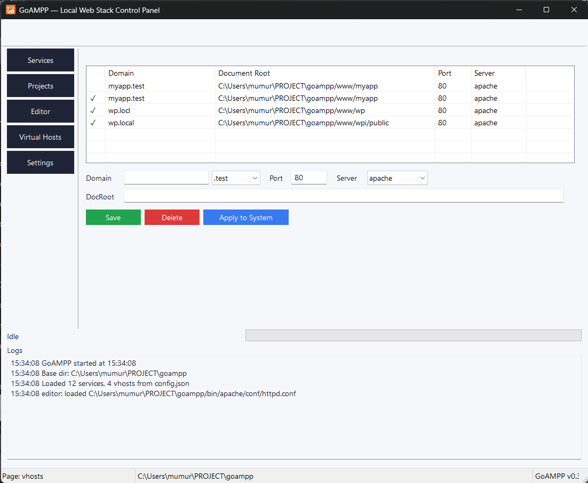
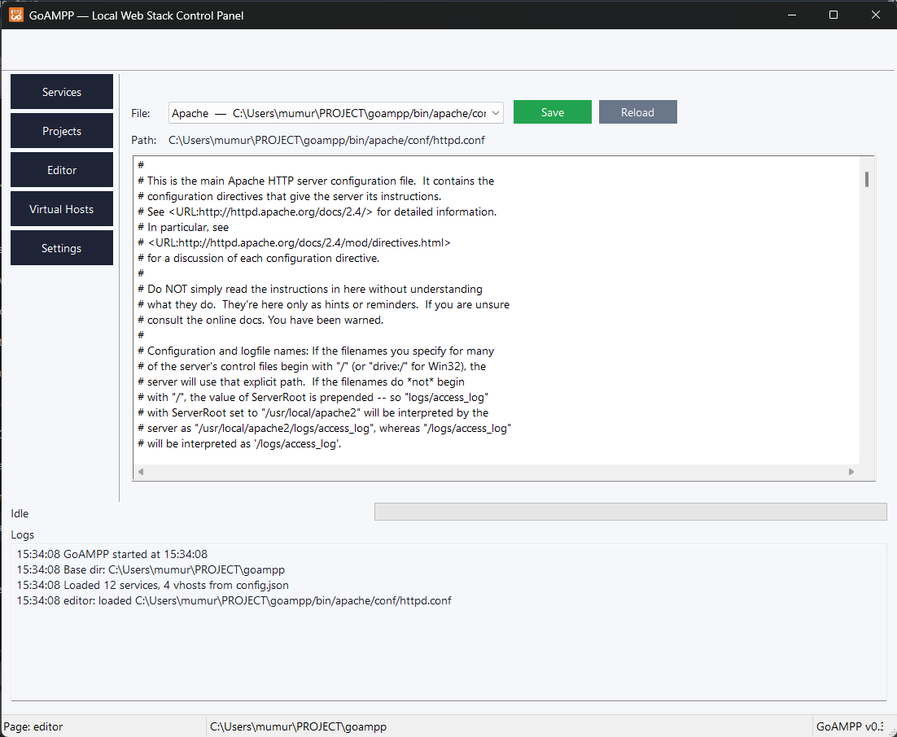
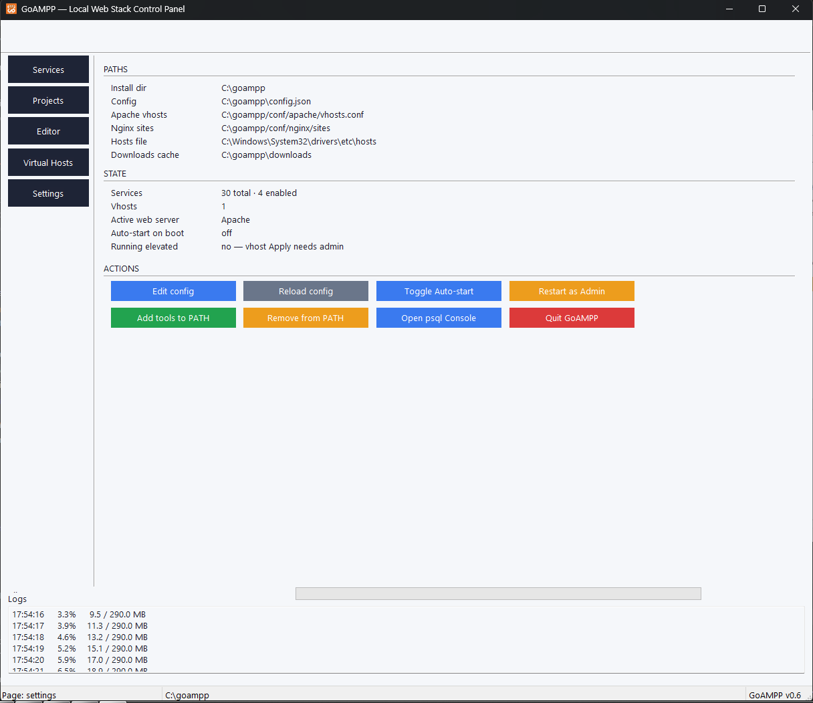

# GoAMPP

A native Windows web-stack control panel written in Go. **One 7 MB binary** that downloads Apache, MariaDB, PHP, PostgreSQL, Redis, RabbitMQ, MinIO, Mailpit, Node.js, Python, Go, Java, and friends on demand — no installer bloat, no Docker, no WSL, no Electron.

[](https://github.com/imtaqin/goampp/releases/latest)
[](LICENSE)



## Features

- **11 services** in the catalog — Apache, Nginx, MariaDB (as MySQL), PostgreSQL, Redis, PHP-FPM, phpMyAdmin, Adminer, pgweb, MinIO, Mailpit, RabbitMQ
- **4 language runtimes** — Node.js LTS, Python (embeddable + auto-bootstrapped pip), Go, Eclipse Temurin JDK 21
- **17 framework scaffolders** — Laravel, Laravel + Livewire, Symfony, CodeIgniter 4, WordPress, Next.js, Vite + React, Express, NestJS, AdonisJS, Flask, Django, FastAPI, Go net/http, Gin, Spring Boot, Static HTML
- **Auto-vhost creation** — writes to Windows hosts file + Apache `vhosts.conf` + Nginx `sites/`
- **Reverse-proxy vhosts** for Node/Python/Go/Java dev servers (Apache forwards `/` → `127.0.0.1:port`)
- **System tray** with minimize-to-tray, close-to-tray, and auto-start on Windows boot
- **Built-in text editor** for service config files (no `notepad.exe` shell-out)
- **"Add tools to PATH"** — appends `bin/*` dirs to user PATH (HKCU registry, broadcasts `WM_SETTINGCHANGE`)
- **Per-card action buttons** (Start / Stop / Restart / Conf), real-time log viewer, download progress bar
- **Process zombie sweep** at startup — cleans stale `httpd.exe` / `mysqld.exe` from prior crashes
- **Per-user install** — no admin needed for the installer; the app elevates on demand only when writing the hosts file

## Screenshots

### Services dashboard
16 service cards in a 4×4 grid, each with its own logo and Start/Stop/Restart/Conf buttons.


### Projects — auto-scaffold + auto-vhost
Pick a framework, type a name, click Create. Composer/npm/pip/go runs in the background, the vhost is registered, and the project is yours.



### Virtual Hosts
List of registered vhosts with an inline form. Domain split into name + extension dropdown so you can't accidentally hit HSTS-preloaded TLDs like `.dev`.



### Built-in editor
Multi-line text editor for `httpd.conf`, `php.ini`, `my.ini`, `redis.conf`, `config.inc.php`, the Windows hosts file, and `config.json`. No notepad shell-out, no external dependencies.



### Settings
Path overview, runtime status (PHP / Composer / Node / Python / Java / Go), elevation status, and global actions including the "Restart as Administrator" relauncher.



## Install

Grab the latest installer from the [Releases page](https://github.com/imtaqin/goampp/releases/latest):

```
goampp-setup-X.Y.Z.exe   ~5.4 MB
```

Installs to **`C:\goampp`** — the short path matches the XAMPP / Laragon convention and dodges MAX_PATH issues that bite deeply-nested project paths on Windows. The installer needs admin once (writing to the system drive root), but grants `users-modify` on every runtime subdirectory so goampp itself runs unelevated after install. Only the one-time install plus future hosts-file edits (for virtual hosts) hit UAC.

The installer creates empty `bin/`, `downloads/`, `tmp/`, `logs/`, `conf/`, and `www/` directories — everything else gets fetched on first start.

## First run

1. **Click any service card's Start button** — GoAMPP downloads + extracts that service's binaries on the fly. First run installs ~12 MB for Apache, ~80 MB for MariaDB, etc.
2. **Click "Start Stack"** below the grid to boot the essential web stack (Apache + MariaDB + phpMyAdmin) in one go.
3. **Open <http://localhost/phpmyadmin/>** — login as `root` with no password.
4. **Switch to the Projects tab** to scaffold a Laravel/Symfony/Express/Flask/Django/etc. project with auto-vhost.

## Build from source

Requires **Go 1.21+ (64-bit)**.

```bash
git clone https://github.com/imtaqin/goampp
cd goampp
go build -ldflags="-H windowsgui -s -w" -trimpath -o goampp.exe .
```

Or use the helper batch file (sets `GOARCH=amd64` for 32-bit Go installs):

```cmd
build.bat
```

Output is a single 7 MB `goampp.exe`. Run it next to `goampp.exe.manifest`, `logo.ico`, and `assets/icons/*.ico` (all in the repo).

## Project layout

```
goampp/
├── main.go                 # entry point + WM_CREATE wiring
├── service.go              # process lifecycle (start/stop/log capture)
├── download.go             # service catalog + downloader/extractor
├── frameworks.go           # framework scaffolders (Laravel, Next.js, ...)
├── vhost.go                # hosts file + Apache/Nginx vhost writers
├── tray.go                 # system tray icon + popup menu
├── ui_tabs.go              # 5 pages (Services/Projects/Editor/Vhosts/Settings)
├── icons.go                # service logo loading via STM_SETICON
├── paint.go                # owner-drawn coloured buttons
├── pathenv.go              # "Add to PATH" + "Restart as Admin"
├── zombies.go              # PowerShell-based stale-process sweep
├── config.go               # config.json load/save
├── assets/icons/*.ico      # 17 service & framework logos (32×32)
├── icon/*.png              # source PNGs (run tools/makelogos to refresh)
├── tools/makeicon/         # one-shot PNG → ICO converter
└── tools/makelogos/        # bulk logo generator (icon/*.png → assets/icons/*.ico)
```

What's in `bin/`, `downloads/`, `logs/`, `tmp/`, `conf/`, and `www/` is gitignored — those directories are populated at runtime.

## How it works (technical highlights)

### Services are downloaded, not bundled
The catalog in `download.go` keys each service by name to a `DownloadSpec` with the URL, install dir, top-level strip prefix, post-install hook, and check file. Click Start → spawn a goroutine → HTTP fetch → atomic rename → extract → run hook → start the process. Cached in `downloads/` so reinstalls skip the network.

### PHP runs via classic CGI, not FastCGI
Apache's `mod_proxy_fcgi` has a 12-year-old Windows bug ([Apache #55345](https://bz.apache.org/bugzilla/show_bug.cgi?id=55345)) where it concatenates the upstream URL with the script's drive-letter path, producing `fcgi://127.0.0.1:9000C:/...` and failing DNS. GoAMPP sidesteps it entirely by using `mod_cgi` + `mod_actions` + `ScriptAlias` to invoke `php-cgi.exe` directly. Slower per request than FastCGI, infinitely more reliable on Windows.

### Process tree kills, not bare `Kill()`
Apache's winnt MPM forks worker children that survive when you kill the parent. `cmd.Process.Kill()` leaves zombies on port 80. The Stop button uses `taskkill /F /T /PID` (the `/T` flag walks the tree) so child processes get cleaned up too.

### Startup zombie sweep via PowerShell
On launch, GoAMPP enumerates every process via PowerShell (`Get-Process | Where-Object { $_.Path }`), filters to anything whose image lives inside `<goampp>/bin/`, and `taskkill /F /T`'s each one. Cleans up stale workers from prior crashes so the next Start doesn't hit "port already in use". Originally used `wmic` but Microsoft removed that from Win11 22H2+.

### Card grid with per-card buttons
The Services view is a hand-built 4×3 grid of widget bundles, not a ListView. Each card holds an `SS_ICON` Static for the logo, three Statics for name/status/version, and four owner-drawn coloured Buttons for Start/Stop/Restart/Conf. Per-card buttons cut the click count in half compared to the "select row → click action" XAMPP pattern.

### Coloured buttons via owner-draw
windigo's default Buttons render with the system theme (gray/white). GoAMPP overrides them with `BS_OWNERDRAW` style + a `WM_DRAWITEM` handler that paints the background with a cached `HBRUSH` (created via direct `gdi32!CreateSolidBrush` syscall — windigo doesn't expose it). Each button registers its colour scheme in a per-ctrl-ID map; the draw handler looks it up and fills accordingly. Green Start, red Stop, orange Restart, blue Conf, slate neutral.

### Tray menu via raw `AppendMenuW`
The tray right-click menu is built with `CreatePopupMenu` + raw `user32!AppendMenuW` syscalls (windigo only exposes the verbose `InsertMenuItem` API that takes a `MENUITEMINFO`). Menu commands route through `wnd.On().WmCommand(id, CMD_MENU, fn)` rather than the generic `Wm(WM_COMMAND, ...)` handler — windigo's `processLast()` special-cases WM_COMMAND and only walks the `cmds` list, so generic interceptors are silently dropped.

## Troubleshooting

### "Access is denied" when applying virtual hosts
Writing to `C:\Windows\System32\drivers\etc\hosts` requires admin. Click **Restart as Administrator** on the Settings page — GoAMPP `ShellExecute("runas", goampp.exe)` triggers a UAC prompt and the elevated instance takes over from the current one cleanly.

### "Port 80 already in use"
Either:
- IIS / Skype / World Wide Web Publishing Service is running. Stop them via `services.msc` or `net stop w3svc`.
- A previous GoAMPP-managed Apache crashed and left a worker zombie. The startup sweep should catch this — if it doesn't, run **Restart Stack** which kills zombies + cleans up + starts fresh.

### Apache `AH00558: Could not reliably determine the server's fully qualified domain name`
Harmless. The post-install hook patches `httpd.conf` to set `ServerName localhost:80` automatically; if you see this warning anyway, your `httpd.conf` is from an older install. Run **Apache → Conf → edit `ServerName`** in the built-in editor or reinstall Apache from the Services tab.

### MySQL won't start: `InnoDB: ./ibdata1 must be writable`
The data directory wasn't seeded. The post-install hook normally runs `mariadb-install-db.exe` automatically. If it didn't, delete `bin/mysql/` and reinstall from the Services tab.

## Comparison to existing Windows stacks

| | GoAMPP | XAMPP | Laragon | Docker Desktop |
|---|---|---|---|---|
| Installer size | **5.4 MB** | ~200 MB | ~100 MB | ~600 MB |
| Admin required to install | ❌ | ✅ | ❌ | ✅ |
| Native Win32 (no runtime) | ✅ | ✅ | ✅ | ❌ (HyperV/WSL) |
| Auto-installs services on demand | ✅ | ❌ | ❌ | N/A |
| Bundles Mercury Mail / Tomcat | ❌ | ✅ | ❌ | ❌ |
| Built-in framework scaffolding | ✅ (17 templates) | ❌ | ✅ (PHP only) | ❌ |
| Auto-vhost on project create | ✅ | ❌ | ✅ | ❌ |
| Open source | ✅ MIT | ✅ | ❌ | ❌ |

## Contributing

Issues and pull requests welcome at [github.com/imtaqin/goampp](https://github.com/imtaqin/goampp).

If a download URL in `download.go` goes stale, file an issue with the service name and I'll bump the catalog. The service URLs use whatever upstream publishes (Apache Lounge for Apache, archive.mariadb.org for MariaDB, etc.) so they age out over time.

## License

MIT. Service logos under `assets/icons/` and `icon/` are trademarks of their respective owners and used here purely for identification.
